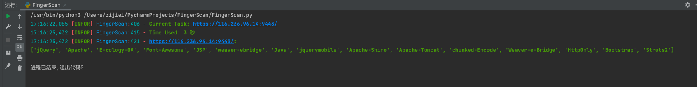

# FingerScan

## 介绍
 - [在线指纹识别](https://finger.imzzj.com)
 - 可匹配ssl证书、title、header、status_code、body, ico_hash、banner、scheme、server、port  
 - 新增waf匹配（默认不开启）

## 软件架构
 - Python3

## 使用说明
```python
task_run(url, finger_dic, waf) # waf:检测waf值True/False 不填默认为False
```


## 指纹规则

 - `body_contains("")    # 响应body包含，支持正则表达式`
 - `title_contains("")   # 网站title包含，支持正则表达式`
 - `header_contains("")  # 响应header包含，支持正则表达式`
 - `server_contains("")  # 响应header中server包含，支持正则表达式`
 - `cert_contains("")    # 响应证书包含，支持正则表达式`
 - `ico_contents("")     # ico包含，多个ico使用｜分割，不支持同时使用md5和mmh3格式ico`

 
```
# 匹配规则写在引号中如果规则中存在引号需转义  
# 不包含写法 
!body_contains("<a class=\"pull-right\" target=\"_blank\"")
# 多个条件格式
((server_contains("server: nginx") and body_contains("Gitee")) or ico_contents("1708240621|1708240622"))
```

## 参考

[EHole](https://github.com/EdgeSecurityTeam/EHole) | [TideFinger](https://github.com/TideSec/TideFinger) | [Glass](https://github.com/s7ckTeam/Glass) | [OneForAll](https://github.com/shmilylty/OneForAll) | [WAFW00F](https://github.com/EnableSecurity/wafw00f)  
